# Laporan Proyek Machine Learning - Ari Fansuri

## Project Overview

Sistem rekomendasi dalam penjualan brand fashion dirancang untuk membantu pelanggan menemukan produk yang sesuai dengan preferensi mereka berdasarkan data historis, pola belanja, dan minat serupa dari pelanggan lainnya. Dengan memanfaatkan algoritma seperti collaborative filtering dan content-based filtering, sistem ini dapat menyarankan produk yang relevan, meningkatkan keterlibatan pelanggan, serta mendorong penjualan produk secara efektif. Dengan mendalami preferensi dan perilaku pengguna, platform e-commerce dapat memberikan rekomendasi produk yang lebih relevan dan dipersonalisasi, sehingga meningkatkan peluang konversi penjualan serta memperkuat retensi pengguna [1]. 

Sistem rekomendasi dirancang untuk menganalisis dan memprediksi preferensi pengguna berdasarkan pola perilaku [2]. Sistem ini tidak hanya memberikan keuntungan kepada pelanggan tetapi juga kepada brand. Melalui analisis data yang mendalam, perusahaan dapat memahami tren pembelian, preferensi pelanggan, dan produk yang sedang populer di pasar. Hal ini memungkinkan pengelolaan stok yang lebih efisien dan pengambilan keputusan bisnis yang lebih tepat. Dengan demikian, sistem rekomendasi tidak hanya menjadi alat pemasaran tetapi juga strategi untuk meningkatkan efisiensi operasional dan daya saing dalam industri fashion yang dinamis.

Hal ini perlu dilakukan karena dalam dunia fashion, preferensi pelanggan dapat berubah dengan cepat, dan volume produk yang tersedia sering kali membuat pelanggan kesulitan memilih item yang sesuai dengan selera mereka. Dengan adanya sistem rekomendasi, brand fashion dapat memberikan pengalaman belanja yang lebih personal dan efisien, mengarahkan pelanggan ke produk yang sesuai dengan gaya, kebutuhan, dan anggaran mereka. Hal ini tidak hanya meningkatkan kepuasan pelanggan tetapi juga memperkuat loyalitas terhadap brand dalam membangun hubungan jangka panjang dengan konsumen.

**Daftar Pustaka**  
[1]. Riswan, D., Putra, H. E. R., & Saputra, R. N. (2024). Pengembangan sistem rekomendasi berbasis kecerdasan buatan untuk meningkatkan pengalaman pengguna di platform e-commerce. _JUKTISI_, _Volume 2_(No. 3), 572–580.

[2]. Fajriansyah, M., Adikara, P. P., & Widodo, A. W. (2021). Sistem rekomendasi film menggunakan content-based filtering. _Jurnal Pengembangan Teknologi Informasi dan Ilmu Komputer_, _Vol. 5_(No. 6), 2188–2199. Fakultas Ilmu Komputer, Universitas Brawijaya. Retrieved from [http://j-ptiik.ub.ac.id](http://j-ptiik.ub.ac.id).

## Business Understanding
### Problem Statements

Menjelaskan pernyataan masalah:
- Bagaimana performa penjualan dari tiap kategori produk?
- Pada jenis kategori produk apa saja 5 pelanggan teratas melakukan pembelian?
- Bagaimana mekanisme model sistem rekomendasi bekerja? 

### Goals

Menjelaskan tujuan proyek yang menjawab pernyataan masalah:
- Memberikan gambaran penjualan pada masing-masing kategori produk.
- Menjelaskan penjualan produk berdasarkan pembelian 5 pelanggan teratas (*Top 5 Spender*).
- Menerapkan dan menguji model sistem rekomendasi yang telah dibuat.

### Solution Approach
- Membangun model sistem rekomendasi menggunakan pendekatan *content based filtering*.
- Membangun model sistem rekomendasi menggunakan pendekatan *collaborative filtering*.

## Data Understanding
Dataset ini adalah kumpulan data yang berfokus pada informasi detail mengenai produk-produk fashion. Data ini diperoleh dari Kaggle, melalui sumber resmi: [Fashion Products Dataset](https://www.kaggle.com/datasets/bhanupratapbiswas/fashion-products/data). Dataset ini dirancang untuk memberikan wawasan yang mendalam mengenai atribut-atribut penting dalam industri fashion, seperti merek, kategori produk, harga, ukuran, warna, dan rating dari pelanggan. 

-   **Ukuran Dataset**: Dataset memiliki  1000 entri, cukup komprehensif untuk analisis dasar di sektor fashion.
-   **Kolom Informasi**: Terdapat 9 kolom yang mencakup informasi seperti identitas produk (`Product_ID`), nama produk, merek, kategori, harga, hingga atribut seperti warna (`Color`) dan ukuran (`Size`).
-   **Jenis Data**: Data ini berisi kombinasi tipe numerik (`int64`,  `float64`) dan kategorikal (`object`), yang memungkinkan eksplorasi data yang kaya untuk berbagai tujuan seperti klasifikasi, analisis harga, atau rekomendasi produk.
-   **Sumber**: Dataset ini berasal dari komunitas Kaggle dan ditujukan untuk membantu eksplorasi data fashion atau pengembangan model machine learning di bidang ini.

| **No.** | **Kolom**      | **Penjelasan**                                                                 |
|---------|----------------|-------------------------------------------------------------------------------|
| 1       | `User_ID`      | ID unik setiap pengguna dalam dataset.                                       |
| 2       | `Product_ID`   | ID unik untuk setiap produk dalam dataset.                                   |
| 3       | `Product_Name` | Nama produk yang diidentifikasi oleh `Product_ID`.                           |
| 4       | `Brand`        | Nama merek produk yang terdaftar.                                            |
| 5       | `Category`     | Kategori produk, misalnya elektronik, pakaian, dll.                         |
| 6       | `Price`        | Harga produk dalam satuan tertentu (misalnya USD atau IDR).                 |
| 7       | `Rating`       | Penilaian pelanggan terhadap produk, dalam skala (misalnya 1 hingga 5).     |
| 8       | `Color`        | Warna produk yang tersedia atau dibeli.                                      |
| 9       | `Size`         | Ukuran produk (misalnya S, M, L, atau dimensi tertentu).                     |

### Variabel Deskriptif

| **Statistic** | **User_ID**   | **Product_ID**  | **Price**     | **Rating**    |
|----------------|---------------|-----------------|---------------|---------------|
| **Count**      | 1000.00000    | 1000.000000     | 1000.000000   | 1000.000000   |
| **Mean**       | 50.41900      | 500.500000      | 55.785000     | 2.993135      |
| **Std**        | 28.78131      | 288.819436      | 26.291748     | 1.153185      |
| **Min**        | 1.00000       | 1.000000        | 10.000000     | 1.000967      |
| **25%**        | 26.00000      | 250.750000      | 33.000000     | 1.992786      |
| **50%**        | 50.00000      | 500.500000      | 57.000000     | 2.984003      |
| **75%**        | 75.00000      | 750.250000      | 78.250000     | 3.985084      |
| **Max**        | 100.00000     | 1000.000000     | 100.000000    | 4.987964      |

Dataset ini terdiri dari 1000 data pengguna, produk, harga, dan rating.  Harga produk pada kolom  **Price**  memiliki rata-rata 55,79 dan standar deviasi 26,29, yang menunjukkan variasi harga cukup moderat. Harga berkisar dari 10 hingga 100, dengan sebagian besar produk memiliki harga di antara 33 dan 78,25. Jumlah rata-rata **Rating** produk adalah 2,99 dengan standar deviasi 1,15. Rating minimum adalah 1 dan maksimum 4,99, dengan sebagian besar produk mendapatkan rating antara 1,99 dan 3,99.

### Data Condition
Dataset yang digunakan dalam analisis ini memiliki kualitas data yang baik, dengan tidak adanya nilai **null**, **duplicate**, maupun **missing values**. Kondisi ini memastikan bahwa data bersih dan siap digunakan untuk proses analisis lebih lanjut tanpa memerlukan penanganan data yang hilang atau tidak valid. Hal ini dibuktikan melalui pemeriksaan statistik dan visualisasi **boxplot** untuk setiap kolom numerik, yang menunjukkan distribusi data secara keseluruhan.

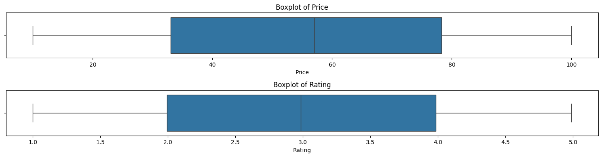  

Boxplot yang dihasilkan tidak menunjukkan adanya data yang kosong atau nilai ekstrim yang tidak valid. Semua kolom numerik seperti `Price`, `Rating`, dan lainnya memiliki distribusi yang terlihat lengkap, dengan persebaran nilai yang sesuai dengan batas logis dataset. Kondisi ini mendukung validitas analisis serta memungkinkan penerapan model machine learning tanpa risiko bias akibat data yang hilang atau duplikasi.

## Univariate Analysis

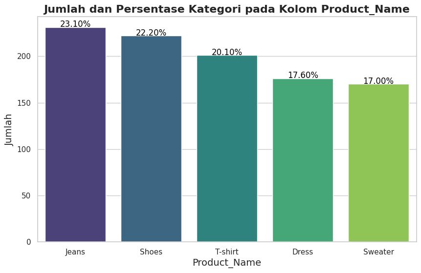  

Dari grafik batang yang dibuat, terlihat bahwa distribusi produk dalam dataset cukup beragam, dengan beberapa kategori memiliki dominasi lebih besar. Kategori **jeans** memiliki proporsi yang paling besar, yaitu sebanyak 23,1%, diikuti dengan produk **shoes** sebesar 22,2%, **t-shirt** 20,1% dan kategori **sweater** memiliki proporsi yang paling kecil, yaitu sebesar 17%. Hal ini menunjukan pada musim penjualan tersebut, produk-produk *casual* dan *versatile* terjual lebih laris dibanding produk yang berorientasi pada kondisi musim dan acara formal, seperti sweater dan dress.

~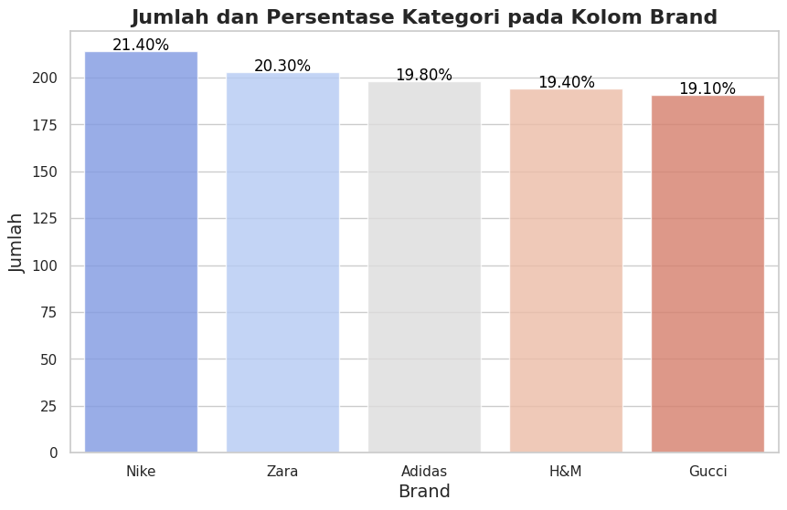  

Berdasarkan grafik batang yang ditampilkan, merk dengan proporsi penjualan paling tinggi yaitu Nike sebesar 21,4% dan yang terendah adalah merk Gucci yaitu sebesar 19,1%.

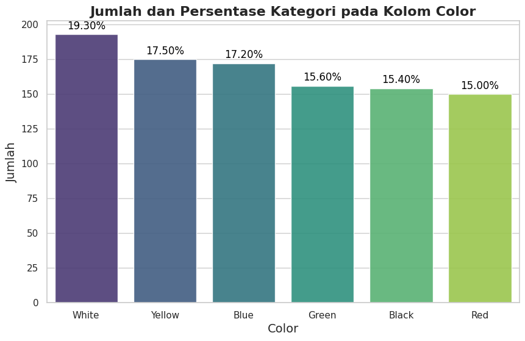  
 
 Produk yang berwarna putih memiliki proporsi penjualan paling tinggi, yaitu sebesar 19,3%. Sedangkan produk yang berwarna hijau, merah dan hitam memiliki proporsi yang paling rendah. Ketiga warna tersebut memiliki penjualan yang seimbang, yaitu di sekitar 15%.

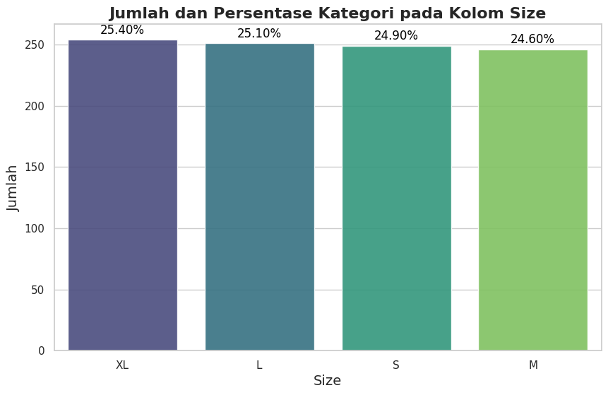  

Proporsi penjualan berdasarkan ukuran, memiliki persentase yang seimbang. Semua ukuran yang terjual, berada di rentang sekitar  25%.

  

Grafik batang di atas menunjukan top 3 product dari masing-masing merek. Berdasarkan 5 merek yang dijual, 4 diantaranya memiliki jenis produk terlaris yang sama yaitu Adidas, Gucci, Nike dan Zara. Sedangkan untuk merk H&M, kategori T-Shirt tidak masuk ke dalam kategori top 3, melainkan Dress.

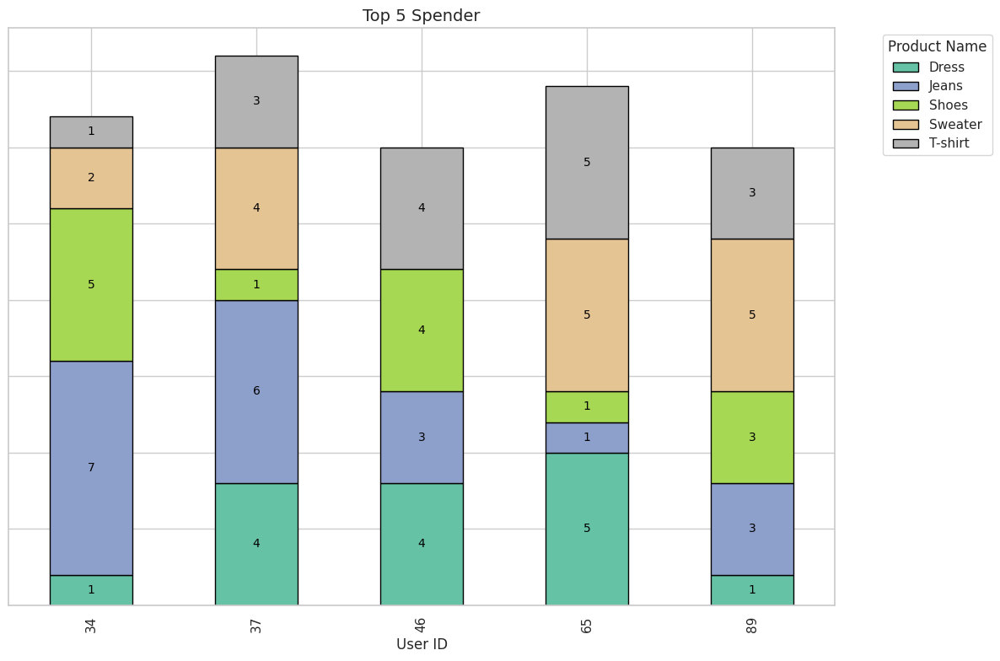  

Grafik menunjukkan lima pengguna dengan pengeluaran tertinggi (*Top 5 Spender*), di mana setiap batang (*bar*) mencerminkan kontribusi kategori produk terhadap total pengeluaran masing-masing pengguna.

**Pengguna dengan Pengeluaran Tertinggi**
- User ID 37 memiliki pengeluaran tertinggi, didominasi oleh kategori *Jeans*. Kontribusi kategori *Sweater* dan *Dress*, namun dengan proporsi lebih kecil dibandingkan *Jeans*.
- User ID 34 menduduki posisi kedua, dengan pembelian terbesar pada kategori *Shoes*, diikuti oleh *Sweater* dan *Jeans*.

**Distribusi Kategori Produk**
- Kategori Dominan:
  - *Shoes* dan *Sweater* merupakan kategori produk yang paling sering muncul, menunjukkan popularitasnya di antara pelanggan utama.
- Kategori Minoritas:
  - *Dress* memiliki kontribusi terkecil secara keseluruhan, kecuali pada beberapa pengguna tertentu seperti User ID 65.

**Preferensi Pengguna**
Setiap pengguna memiliki preferensi unik terhadap produk:
  - User ID 46 dan 65 memiliki pengeluaran yang relatif merata di beberapa kategori seperti *Shoes*, *Sweater*, dan *T-shirt*.
  - User ID 89 menunjukkan kecenderungan pada *Sweater* dan *Shoes*, tanpa kontribusi signifikan dari kategori lainnya.

## Data Preprocessing
### TF-IDF Vectorizer (Untuk Cosine Similiarity)
Data diproses menggunakan `TfidfVectorizer` dari pustaka `sklearn`, yang dirancang untuk mengubah teks menjadi representasi vektor numerik berbasis TF-IDF (Term Frequency-Inverse Document Frequency). Parameter `stop_words='english'` digunakan untuk menghapus kata-kata umum dalam bahasa Inggris yang tidak memberikan nilai informasi signifikan, seperti "the", "and", dll.

**Kolom yang diproses**:
- *Product Name*: Nama produk.
- *Category*: Kategori produk.
- *Color*: Warna produk.
- *Size*: Ukuran produk.

Setiap kolom teks ini diubah menjadi matriks TF-IDF menggunakan `fit_transform`. Proses ini menghasilkan matriks berbentuk `[n_samples, n_features]`, di mana:
- *n_samples*: Jumlah data (baris).
- *n_features*: Jumlah fitur unik (kata atau istilah) dalam teks setelah preprocessing.
 
Ukuran matriks TF-IDF untuk masing-masing kolom ditampilkan untuk memastikan keberhasilan transformasi dan memahami dimensi data hasil preprocessing menggunakan fungsi `shape`. Berikut adalah hasil yang diperoleh.
| Kolom          | Bentuk Matriks TF-IDF | Penjelasan                                 |
|-----------------|-----------------------|-------------------------------------------|
| Product Name    | (1000, 5)            | 1000 sampel dengan 5 fitur unik           |
| Category        | (1000, 4)            | 1000 sampel dengan 4 fitur unik           |
| Color           | (1000, 6)            | 1000 sampel dengan 6 fitur unik           |
| Size            | (1000, 1)            | 1000 sampel dengan 1 fitur unik           |

**Penggabungan Matriks**:
   - Menggunakan fungsi `hstack` dari `scipy.sparse`, matriks TF-IDF dari masing-masing kolom digabung secara horizontal.
   - Matriks hasil penggabungan mengintegrasikan informasi dari berbagai atribut menjadi satu representasi yang komprehensif.

**Bentuk Akhir Matriks**:
 Setelah penggabungan, matriks memiliki dimensi `(1000, 16)`, di mana 1000 adalah jumlah baris (sampel) dan 16 adalah total jumlah fitur unik dari semua atribut teks. Dengan menggabungkan TF-IDF dari berbagai atribut, matriks akhir dapat menangkap informasi yang lebih lengkap, seperti hubungan antara nama produk, kategori, warna, dan ukuran.

Setelah penggabungan, semua informasi fitur dari berbagai atribut produk (nama, kategori, warna, ukuran) kini berada dalam satu representasi matriks gabungan, yang dapat digunakan sebagai input untuk model machine learning. Lalu, metode `.todense()` digunakan untuk mengonversi matriks sparse menjadi matriks padat (dense matrix). Berikut adalah output matrix yang dihasilkan:

>   ([[1., 0., 0., ..., 0., 0., 1.],
        [0., 0., 0., ..., 0., 0., 0.],
        [1., 0., 0., ..., 0., 1., 1.],
        ...,
        [0., 0., 0., ..., 1., 0., 0.],
        [0., 0., 1., ..., 0., 0., 0.],
        [0., 0., 0., ..., 1., 0., 0.]])
        
### Label Encoding (Untuk Deep Learning)
Label Encoding adalah teknik untuk mengubah data kategori (seperti teks atau label) menjadi angka. Setiap nilai unik dalam kolom diberi angka integer sebagai representasi. Teknik label encoding diperlukan dengan alasan:

- Model berbasis  *Collaborative Filtering* memetakan user dan produk ke ruang vektor numerik.
- Representasi numerik ini penting untuk menghitung kemiripan atau memprediksi skor rating.
- Encoding memastikan bahwa setiap User_ID dan Product_ID memiliki indeks unik.
- Mempercepat proses komputasi.

**Tahapan**:
1. Impor Library: Gunakan `pandas` untuk manipulasi data dan `numpy` untuk operasi numerik.
2. Filter Data: Ambil kolom `User_ID`, `Product_ID`, dan `Rating` sebagai data utama.
3. Encoding ID: Ubah `User_ID` dan `Product_ID` menjadi indeks numerik untuk mempermudah pengolahan data.
4. Skala Rating (Opsional): Normalisasi nilai rating menjadi rentang 0 hingga 1.
5. Pembagian Data: Pisahkan dataset menjadi 80% data latih dan 20% data uji menggunakan `train_test_split`.
6. Verifikasi Data: Tampilkan data latih dan uji untuk memastikan pembagian berhasil.

Berikut adalah hasil dari pemrosesan label encoding:

### Data Train:
| User_ID | Product_ID |   Rating   | user | product |   rating   |
|---------|------------|------------|------|---------|------------|
|      20 |         30 |  3.110114  |   25 |      29 |  0.623524  |
|      82 |        536 |  3.347461  |   24 |     535 |  0.671108  |
|      81 |        696 |  4.592767  |   82 |     695 |  0.920770  |
|       2 |        558 |  2.026682  |   57 |     557 |  0.406315  |
|      59 |        837 |  2.406013  |   80 |     836 |  0.482364  |

---

### Data Test:
| User_ID | Product_ID |   Rating   | user | product |   rating   |
|---------|------------|------------|------|---------|------------|
|      24 |        522 |  2.939080  |   40 |     521 |  0.589234  |
|      30 |        738 |  1.033843  |   86 |     737 |  0.207268  |
|      49 |        741 |  3.386837  |   88 |     740 |  0.679002  |
|      30 |        661 |  1.533612  |   86 |     660 |  0.307463  |
|      66 |        412 |  3.402410  |   90 |     411 |  0.682124  |

## Modeling
### Cosine Similiarity
Cosine similarity adalah metrik yang digunakan untuk mengukur kesamaan antara dua vektor berdasarkan sudut kosinus di antara keduanya dalam ruang multidimensi. Metrik ini sangat populer dalam pemrosesan teks dan aplikasi berbasis data seperti sistem rekomendasi, karena berfokus pada orientasi vektor (arah) daripada magnitudo vektor. Berikut adalah kode yang digunakan untuk memnggunakan cosine similiarity dari library scikit-learn.

`from sklearn.metrics.pairwise import cosine_similarity`

**Rumus**

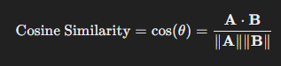  

Dimana:
-   **AxB** adalah perkalian antara dua vektor.
-   **∥A∥** adalah panjang (norma) dari vektor **A**, yang dihitung sebagai:

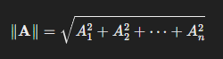  

- **∥B∥** adalah panjang (norma) dari vektor **B**, yang dihitung dengan cara yang sama seperti vektor **A**.

Dapat diuriakan menjadi rumus berikut:

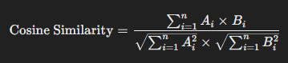  

Nilai cosine similarity berkisar antara:
- 1: Vektor memiliki arah yang sama (kesamaan sempurna).
- 0: Vektor saling ortogonal (tidak ada kesamaan).
- 1: Vektor memiliki arah yang berlawanan (kesamaan negatif).

**Kelebihan**
1. Skalabilitas: Tidak dipengaruhi oleh panjang vektor, hanya fokus pada arah.
2. Efisiensi: Dapat dihitung dengan cepat menggunakan dot product.
3. Relevansi untuk Data Teks: Cocok untuk data berbasis kata seperti matriks TF-IDF atau data embedding.

**Kekurangan**
1. Tidak Memperhatikan Magnitudo: Perbedaan bobot pada elemen vektor diabaikan.
2. Sparsity Sensitivity: Matriks jarang (*sparse*) dapat menghasilkan nilai nol jika tidak ada elemen yang beririsan.

Berdasarkan hasil penerapan algoritma cosine similiarity, diperoleh hasil 5 teratas produk rekomendasi sebagai berikut:
| Product_ID | Product_Name | Brand  | Color | Size |
|------------|--------------|--------|-------|------|
| 218        | Sweater      | Gucci  | Red   | M    |
| 411        | Sweater      | Nike   | Red   | M    |
| 581        | Sweater      | Zara   | Red   | L    |
| 710        | Sweater      | Zara   | Red   | S    |
| 335        | Sweater      | Gucci  | Red   | XL   |

### Deep Learning 
Model dibangun menggunakan kelas **RecommenderNet**, yaitu model rekomendasi berbasis deep learning yang dirancang menggunakan TensorFlow dan Keras. Berikut adalah kelebihan dan kekurangan pada RecommenderNet:

#### Kelebihan:

-   Kemampuan Menangkap Pola Non-Linear  
    RecommenderNet menggunakan embedding dan dense layers, sehingga dapat menangkap pola interaksi yang kompleks antara pengguna dan produk, yang sulit ditangkap oleh metode rekomendasi tradisional seperti matrix factorization.
    
-   Fleksibilitas Model
    Model ini fleksibel karena dapat disesuaikan dengan ukuran embedding, arsitektur jaringan (jumlah dan jenis lapisan), dan teknik regularisasi untuk mengurangi overfitting.
    
-   Kemampuan Menangani Data Sparsity  
    Dengan menggunakan embedding, model tetap dapat memberikan rekomendasi meskipun data memiliki banyak nilai kosong (sparsity), yang sering terjadi dalam sistem rekomendasi.
    
-   Skalabilitas  
    Embedding yang kompak memungkinkan model untuk diimplementasikan pada dataset yang besar dengan jumlah pengguna dan produk yang banyak, asalkan memori GPU mencukupi.
    
-   Regularisasi Bawaan  
    Model ini menggunakan regularisasi L2 pada embedding dan lapisan dense, yang membantu menjaga performa model pada dataset yang kecil atau tidak seimbang.

#### Kekurangan:
-   Kompleksitas dan Waktu Latih yang Tinggi  
    Dibandingkan metode tradisional, seperti collaborative filtering berbasis algoritma ALS atau SVD, RecommenderNet membutuhkan lebih banyak waktu pelatihan karena melibatkan proses optimisasi yang kompleks.
    
-   Memerlukan Banyak Data  
    Model ini cenderung membutuhkan dataset besar agar embedding dapat dilatih dengan baik, terutama untuk mencegah overfitting pada dataset kecil.
    
-   Overfitting pada Data Kecil  
    Jika dataset tidak cukup besar, model dapat dengan mudah overfit meskipun menggunakan regularisasi.
    
-   Kesulitan Interpretasi  
    Karena menggunakan jaringan neural yang kompleks, sulit untuk memahami bagaimana model memutuskan rekomendasi, berbeda dengan metode berbasis matriks yang lebih mudah diinterpretasikan.
    
-   Ketergantungan pada Hyperparameter  
    Performanya sangat bergantung pada pemilihan hyperparameter seperti ukuran embedding, learning rate, dan jumlah epoch. Pemilihan yang tidak optimal dapat mengurangi performa model.
    
-   Tidak Menangani Cold Start dengan Baik  
    Sama seperti metode rekomendasi berbasis kolaborasi lainnya, model ini sulit memberikan rekomendasi yang baik untuk pengguna atau produk baru yang tidak memiliki interaksi sebelumnya.

#### Proses membangun model
Model ini memanfaatkan embedding untuk merepresentasikan pengguna dan produk dalam bentuk vektor numerik di ruang dimensi tertentu. Dua embedding layer digunakan untuk mengonversi User_ID dan Product_ID menjadi representasi vektor berdimensi 50. Vektor-vektor ini kemudian dikombinasikan melalui operasi `dot product` untuk menghitung kemiripan atau interaksi antara pengguna dan produk.

Untuk menangani kekurangan yang dimiliki pada model dasar RecommenderNet, maka model juga dibangun dengan menambahkan lapisan dropout regularisasi untuk mengurangi risiko overfitting dan dense layer dengan 128 unit untuk menangkap hubungan non-linear antara pengguna dan produk. Model ini menghasilkan satu output berupa prediksi rating melalui lapisan terakhir yang memiliki fungsi aktivasi linear. Dengan arsitektur ini, model dapat belajar pola interaksi kompleks dari data user-produk untuk memberikan prediksi rekomendasi yang lebih akurat.

Selanjutnya parameter model seperti jumlah pengguna (num_users), jumlah produk (num_products), dan ukuran embedding (embedding_size), ditentukan berdasarkan dataset. Model kemudian dikompilasi menggunakan fungsi loss `mean squared error` (MSE) untuk mengukur selisih antara rating aktual dan prediksi, serta optimizer `Adam` dengan learning rate sebesar 1e-4 untuk mempercepat dan menstabilkan proses pelatihan.

Data `x_train` dan `x_test` yang terdiri dari pasangan indeks numerik pengguna dan produk, sedangkan target `y_train` dan `y_test` adalah nilai rating yang telah diskalakan sebelumnya. Model dilatih selama 100 epoch dengan ukuran batch 64 menggunakan metode backpropagation.

Berikut merupakan konfigurasi *custom* parameter yang dibangun pada model:
- Jumlah Pengguna: `num_users` (disesuaikan dengan jumlah user)
- Jumlah Produk: `num_products` (disesuaikan dengan jumlah produk)
- Dimensi Embedding: `embedding_size=50`
- Regularizer: L2 (1e-6 di embedding, 0.01 di Dense)
- Dropout: 0.2
- Lapisan Dense: 128 unit
- Fungsi Aktivasi: ReLU
- Fungsi Loss: Mean Squared Error
- Optimizer: Adam (Learning Rate = 1e-4)
- Batch Size: 64
- Epochs: 100

Berdasarkan hasil penerapan model base RecommenderNet, diperoleh hasil 5 teratas produk rekomendasi sebagai berikut:
| Product_ID | Product_Name | Brand   | Category        | Price |
|------------|--------------|---------|-----------------|-------|
| 501        | Sweater      | Adidas  | Kids' Fashion   | 41    |
| 684        | Dress        | Adidas  | Women's Fashion | 12    |
| 731        | Sweater      | Adidas  | Men's Fashion   | 62    |
| 808        | T-shirt      | Adidas  | Women's Fashion | 26    |
| 833        | Sweater      | H&M     | Kids' Fashion   | 82    |

Berdasarkan perbandingan hasil yang diperoleh pada model yang telah dibangun, model terbaik yang menjadi pilihan adalah model RecommenderNet yang dikonfigurasi secara kustom melalui hyperparameter. Dengan pemilihan hyperparameter yang tepat, performa model mampu meningkat dengan baik sekaligus mengatasi kekurangan yang ada pada model dasar.

## Evaluation
### Cosine Similiarity
**1. Membuat Ground Truth untuk Evaluasi Rekomendasi**

a. Mengambil Kolom `Product_ID` dan `Category`
- Data yang digunakan berasal dari dataset `df`, hanya mengambil kolom `Product_ID` dan `Category`.
- Mengelompokkan Produk Berdasarkan Kategori
- Produk dalam setiap kategori dikelompokkan menggunakan `groupby` dan dikonversi menjadi sebuah dictionary, di mana:
	- Kunci (`key`) adalah nama kategori.
	- Nilai (`value`) adalah daftar `Product_ID` yang termasuk dalam kategori tersebut.

b. Membangun Ground Truth
- Untuk setiap produk dalam kategori:
- Produk tersebut dijadikan kunci dalam dictionary `ground_truth`.
- Daftar produk lain dalam kategori yang sama (kecuali produk itu sendiri) dijadikan sebagai nilai.
- Tujuannya adalah memberikan daftar produk relevan untuk setiap produk berdasarkan kategori.

c. Menampilkan Sampel Ground Truth
- Hanya menampilkan sebagian kecil hasil ground truth (5 entri pertama) untuk keperluan inspeksi.

**2. Fungsi untuk Menghitung Precision**

a. Definisi Fungsi  
   - Fungsi `calculate_precision` digunakan untuk menghitung skor precision berdasarkan cosine similarity.

b. Parameter Masukan  
   - `cosine_sim`: Matriks cosine similarity antar produk.
   - `product_ids`: Daftar `Product_ID` yang sesuai dengan urutan indeks di `cosine_sim`.
   - `ground_truth`: Dictionary yang berisi daftar produk relevan untuk setiap `Product_ID`.
   - `top_n`: Jumlah rekomendasi teratas yang akan dipertimbangkan (default: 5).

c. Perhitungan Precision  
  - Urutkan skor similarity dari tinggi ke rendah menggunakan `np.argsort(-cosine_sim[i])`.  
  - Abaikan indeks pertama (produk itu sendiri).  
  - Konversi indeks menjadi `Product_ID` untuk daftar rekomendasi.  
   - Precision dihitung sebagai rasio antara jumlah produk yang direkomendasikan dan relevan (`relevant_products & recommended_set`) dengan total produk yang direkomendasikan (`recommended_set`). 
   - Jika tidak ada rekomendasi, precision bernilai 0.

d. Hasil Fungsi  
   - Mengembalikan dictionary berisi skor precision untuk setiap `Product_ID`.

**3. Menghitung Rata-Rata Precision**

a. Mengambil Daftar `Product_ID`  
   - `product_ids` berisi daftar `Product_ID` dari dataset, sesuai urutan indeks dalam matriks cosine similarity (`cosine_sim`).

b. Menghitung Precision untuk Setiap Produk  
   - Fungsi `calculate_precision` digunakan untuk menghitung skor precision untuk masing-masing produk berdasarkan nilai cosine similarity, `Product_ID`, dan `ground_truth`.  
   - Parameter `top_n=5` menunjukkan bahwa precision dihitung untuk 5 rekomendasi teratas.

c. Menghitung Rata-Rata Precision  
   - Semua skor precision yang dihitung untuk produk dirata-ratakan menggunakan `np.mean()`.

d. Menampilkan Hasil  
   - Precision rata-rata (Top-5) ditampilkan dalam format angka desimal dengan 4 digit di belakang koma.

Berikut merupakan hasil perhitungan nilai precision yang diperoleh:

> Rata-rata Precision (Top-5): 0.8728

Hasil rata-rata precision (Top-5) sebesar **0.8728** menunjukkan bahwa model rekomendasi berbasis cosine similarity memiliki kinerja yang baik, dengan sekitar 87.28% produk yang direkomendasikan dalam 5 teratas benar-benar relevan sesuai dengan _ground truth_. Ini mencerminkan tingkat akurasi tinggi dalam memberikan rekomendasi yang relevan berdasarkan kategori produk. Namun, hasil ini juga dipengaruhi oleh kualitas _ground truth_, parameter model, dan dataset yang digunakan.

### RecommenderNet
Penilaian hasil dari performa model yang telah dibuat menggunakan Mean Squared Error (MSE), berfungsi untuk mengukur seberapa dekat hasil prediksi model dengan nilai aktual pada data kontinu. MSE dihitung dengan mengambil rata-rata dari kuadrat perbedaan antara nilai prediksi dan nilai aktual. Matriks ini sering digunakan dalam tugas regresi, termasuk dalam sistem rekomendasi untuk mengevaluasi seberapa akurat prediksi rating. Formula yang digunakan adalah sebagai berikut:

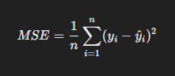  

-  yi ​: Nilai aktual.
-  ȳi ​: Nilai prediksi.
-   n : Jumlah sampel data.

Nilai MSE yang kecil menunjukkan bahwa prediksi model mendekati nilai aktual. Sebaliknya, nilai MSE yang besar mengindikasikan prediksi model memiliki kesalahan yang signifikan.

Dari hasil pelatihan model dengan skema ukuran batch sebanyak 64 bagian, epoch sebanyak 100 dan verbose 1, diperoleh nilai sebagai berikut:

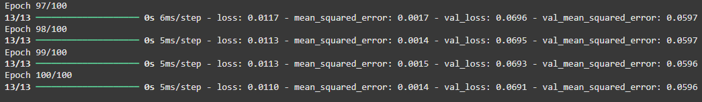  

Berikut adalah proses training jika ditampilkan dalam bentuk gambar plot:

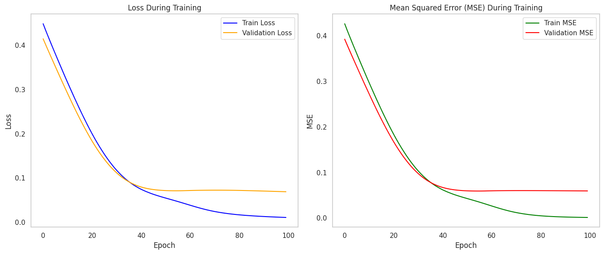  

-   **Loss (train loss): 0.011**  
    Nilai loss ini menunjukkan seberapa baik model memprediksi rating pada data pelatihan. Dengan menggunakan fungsi loss *mean squared error (MSE)*, nilai ini menunjukkan rata-rata kuadrat dari kesalahan prediksi. Nilai yang kecil seperti 0.011 menandakan bahwa model telah mempelajari pola data dengan baik pada set pelatihan.
    
-   **Mean Squared Error (MSE): 0.0014**  
    MSE untuk data pelatihan menunjukkan bahwa rata-rata kesalahan prediksi model sangat kecil dalam hal skala rating yang digunakan. Hal ini mendukung bahwa model memiliki performa yang baik pada data pelatihan.
    
-   **Validation Loss: 0.0691**  
    Validation loss mengukur performa model pada data validasi yang tidak dilibatkan dalam pelatihan. Nilai ini lebih tinggi dibandingkan train loss, yang mengindikasikan bahwa model sedikit kesulitan untuk sepenuhnya generalisasi pola dari data pelatihan ke data baru. Namun, selisih yang tidak terlalu besar (0.0691 vs 0.011) menandakan bahwa model tidak mengalami overfitting yang signifikan.
    
-   **Validation MSE: 0.0596**  
    MSE pada data validasi lebih tinggi dibandingkan data pelatihan, menunjukkan adanya sedikit perbedaan antara prediksi model pada data yang belum dilihat sebelumnya dibandingkan dengan data pelatihan. Namun, nilai ini tetap cukup rendah, menandakan bahwa model telah mempelajari hubungan antara pengguna dan produk secara efektif.

Secara keseluruhan, hasil ini menunjukkan bahwa model `RecommenderNet` memiliki performa yang baik dan mampu memprediksi rating dengan tingkat kesalahan yang rendah pada data pelatihan maupun data validasi.

## Summary
1. Masing-masing merk memiliki produk andalan yang menjadi top performance penjualan. Contohnya adalah merk H&M yang memiliki 3 produk teratas berbeda dibanding kompetitor lainnya. Khusus untuk merk H&M, produk top 3 performance tanpa kategori T-Shirt.
2. *Shoes* dan *Sweater* merupakan kategori produk yang paling sering muncul, menunjukkan popularitasnya di antara 5 pelanggan dengan pembelian tertinggi.
3. RecommenderNet lebih unggul dibandingkan cosine similarity karena pendekatan ini mempertimbangkan interaksi historis pengguna, sehingga menghasilkan rekomendasi yang lebih personal dan relevan. Nilai yang diperoleh RecommenderNet sudah cukup baik untuk model _collaborative filtering_. Cosine similarity cocok untuk kasus sederhana, tetapi kurang efektif jika dataset memiliki banyak pengguna dengan preferensi yang beragam. Oleh karena itu, RecommenderNet adalah pilihan terbaik untuk skenario rekomendasi yang lebih kompleks.
